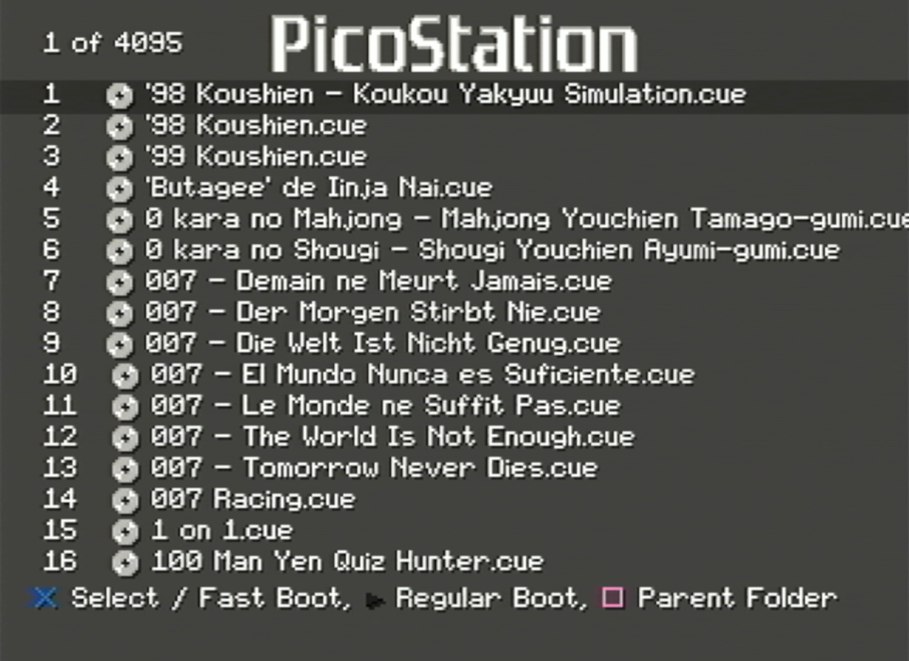

# Picostation Menu Loader

## Work in progress menu loader for work in progress picostation project.

This counts as my first C project, first ps1 project so don't get too harsh on me while criticizing :)
This loader is not currently working by itself. For this to work, i am making minor adjustments to picostation code itself, so even if you build, you won't be able to use it with current versions of picostation. So i will add precompiled binaries as release. I am embedding compiled binaries into the picostation firmware and using its ram load function.

There are still missing features and bugs exists all around it, so be careful while using it.

Select game with X, triangle refreshes list, L1+R1 puts pico into bootloader mode.

## Follow picostation developments here
#### https://github.com/johnbaumann/picostation

This project uses Spicyjpeg's ps1 bare metal. Also contains a lot of copy paste from Rhys-Baker's demo bare metal project so take a look!

#### https://github.com/spicyjpeg/ps1-bare-metal
#### https://github.com/Rhys-Baker/PSXProject

For making an image, you need mkpsxiso in your path
#### https://github.com/Lameguy64/mkpsxiso

Huge thanks to Rama, Spicyjpeg, Danhans42, NicholasNoble and ChatGPT for their support!
Huge thanks to Skitchin for not letting this project die!

Visit psx.dev discord!
### https://www.psx.dev/

